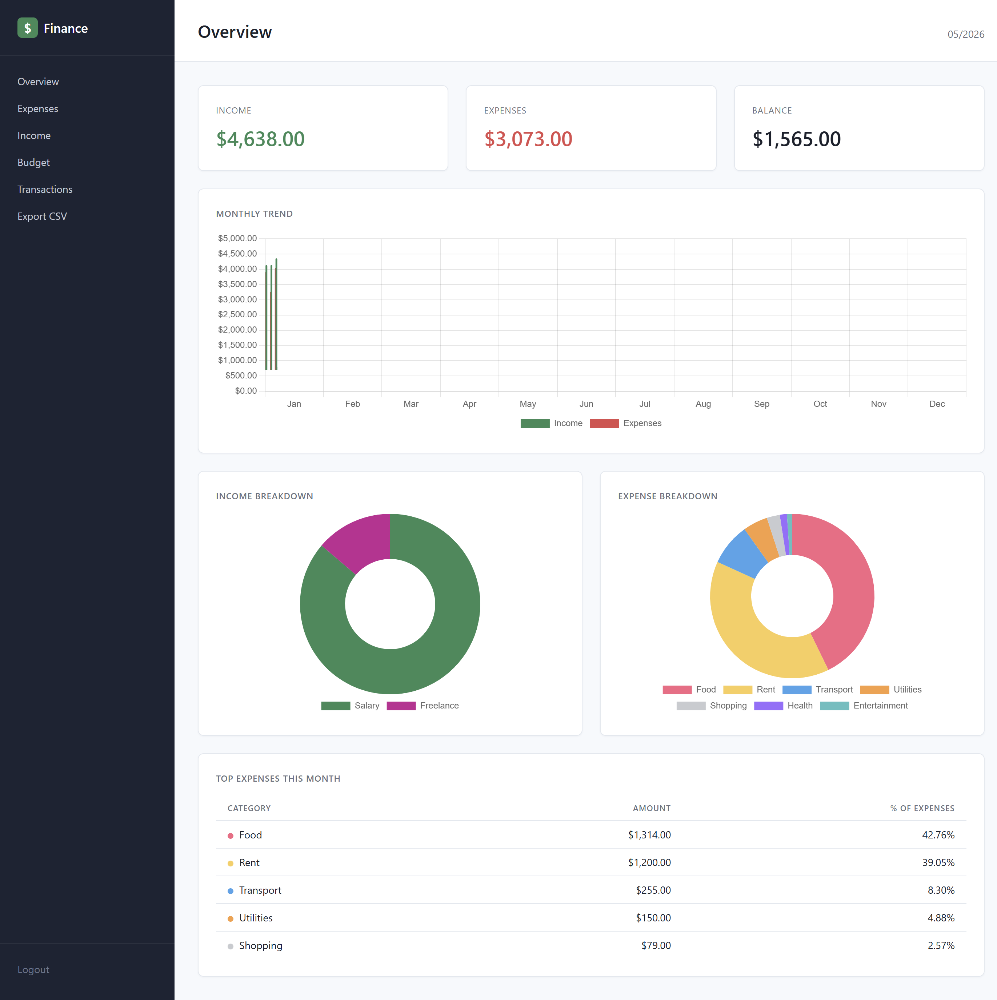
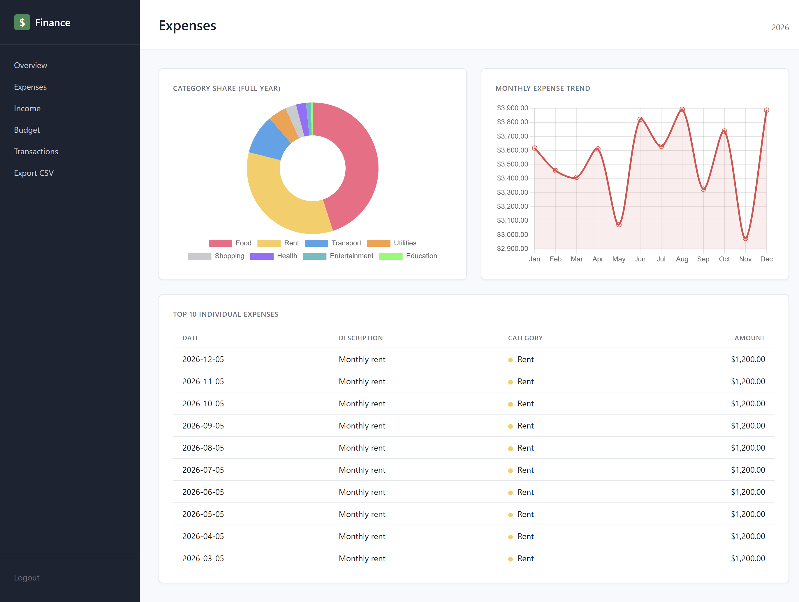
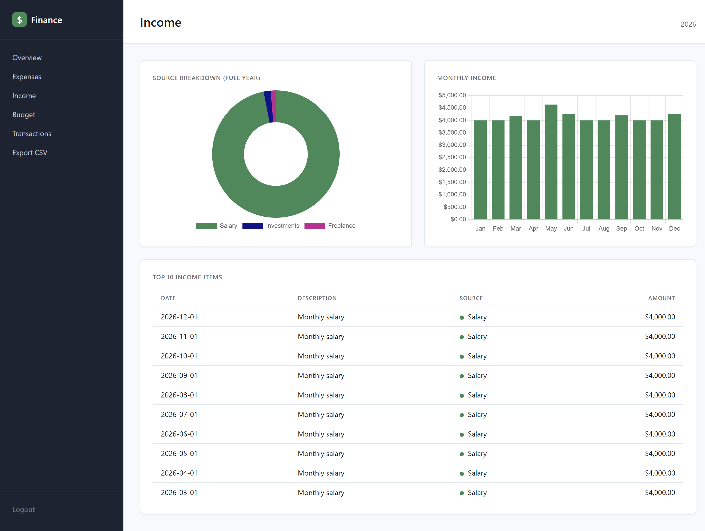
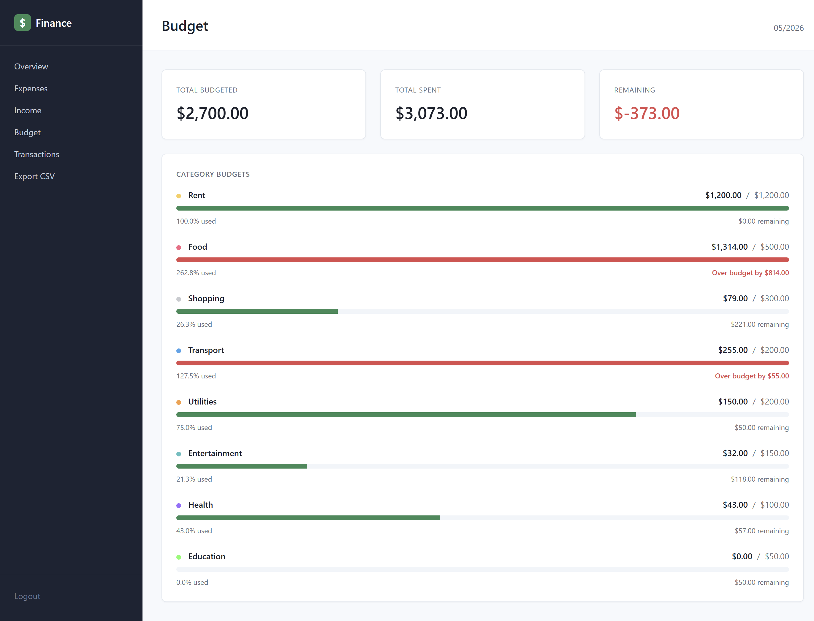
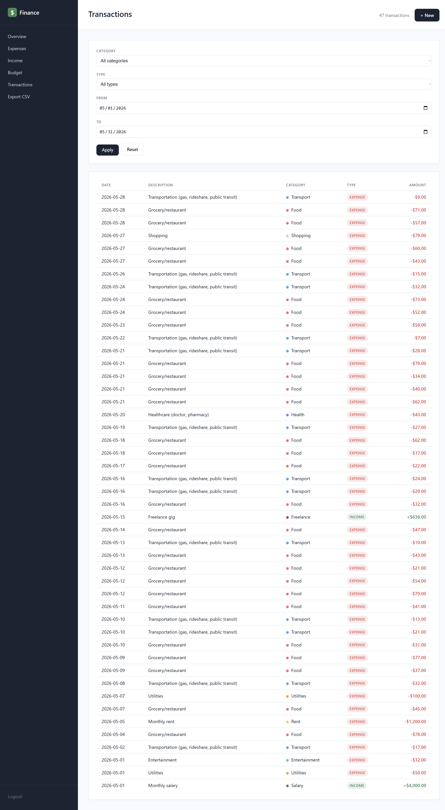
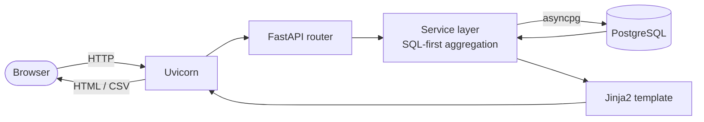

# Financial Analytics Dashboard

> A server-rendered personal finance dashboard built with FastAPI, async PostgreSQL, and SQL-first aggregations.

A multi-page web app for tracking income, expenses, and budgets. Users log in, browse interactive dashboards, add transactions through validated forms, and export their financial history to CSV. No SPA, no React — just clean Jinja2 templates and well-shaped SQL.

This is **Project 5 of 6** in my backend portfolio.

---

## Screenshots

> _Capture pending — placeholders below. Run the app locally to see the live UI._

| Page | Preview |
|---|---|
| Overview |  |
| Expenses |  |
| Income |  |
| Budget |  |
| Transactions |  |

---

## What it does

- **Overview** — KPI cards for the current month (income, expenses, balance), a 12-month bar chart, two donut breakdowns (income sources / expense categories), and a top-5 expenses table.
- **Expenses** — full-year category share donut, monthly trend line, and the top 10 individual expenses.
- **Income** — full-year source breakdown donut, monthly bars, and the top 10 income items.
- **Budget** — per-category progress bars for the current month with under/over indicators.
- **Transactions** — filterable, paginated transaction list (category, type, date range) with a validated form for adding new entries.
- **Export** — streaming CSV download of the full transaction history (UTF-8 BOM for Excel compatibility).

---

## Tech stack

| Component | Technology |
|---|---|
| Web framework | FastAPI ≥ 0.115 |
| ASGI server | Uvicorn ≥ 0.30 |
| Templating | Jinja2 (server-side rendering) |
| Database | PostgreSQL 16 + asyncpg (async driver) |
| ORM/toolkit | SQLAlchemy ≥ 2.0 (async) |
| Charts | Chart.js 4.4 (CDN) |
| Auth | Starlette `SessionMiddleware` + bcrypt password hashing |
| Settings | pydantic-settings |
| Export | CSV via Python stdlib (`csv`, streaming) |
| Testing | pytest + pytest-asyncio + httpx (`ASGITransport`) |
| Containerization | Docker + docker-compose (multi-stage build) |
| Python | 3.11 |

---

## Architecture



**Layer-based design** (not Clean Architecture): `database/`, `services/`, `routers/`, `templates/`. Each request flows browser → router (auth check + parsing) → service (SQL aggregation) → template (HTML/JSON) → browser. The service layer never returns ORM objects; it maps query results into plain dataclasses defined in `app/schemas/contracts.py`, keeping templates and tests independent of database internals.

**SQL-first aggregations.** Heavy lifting (`GROUP BY`, window functions, percent-of-total) happens in PostgreSQL. The `fetch_breakdown` query, for instance, computes per-category totals and grand-total percentages in a single pass using `ROUND(SUM(t.amount) * 100.0 / SUM(SUM(t.amount)) OVER (), 2)`. Python only iterates rows into dataclasses.

---

## Quick start

```bash
git clone https://github.com/HelioZF/financial-analytics-dashboard.git
cd financial-analytics-dashboard
cp .env.example .env
docker compose up --build
```

Then open <http://localhost:3200/login> and sign in:

- **Username:** `demo`
- **Password:** `demo123`

The seed script populates 12 months of narrative transactions on first run (idempotent — re-running compose is safe).

To stop and reset: `docker compose down -v` (the `-v` removes the database volume).

---

## Project structure

```
financial-analytics-dashboard/
├── app/
│   ├── main.py                # FastAPI app, session middleware, router wiring
│   ├── config.py              # pydantic-settings
│   ├── auth.py                # login/logout, bcrypt verify, require_login dep
│   ├── database/
│   │   └── connection.py      # async engine, SessionLocal, get_session dep
│   ├── routers/               # one router per page
│   │   ├── overview_router.py
│   │   ├── expenses_router.py
│   │   ├── income_router.py
│   │   ├── budget_router.py
│   │   ├── transactions_router.py
│   │   └── export_router.py
│   ├── services/              # SQL aggregation per page
│   │   ├── overview_service.py
│   │   ├── expenses_service.py
│   │   ├── income_service.py
│   │   ├── budget_service.py
│   │   ├── transactions_service.py
│   │   └── export_service.py
│   ├── schemas/
│   │   ├── entities.py        # User, Transaction, Category, Budget
│   │   └── contracts.py       # Page-level dataclasses (KPIs, breakdowns, etc.)
│   ├── templates/             # Jinja2 (base.html + per-page summary.html)
│   └── static/style.css
├── migrations/init.sql        # Schema with indexes + constraints
├── seed/seed.py               # Idempotent 12-month narrative seed
├── tests/                     # 36 pytest tests (smoke, service, integration)
├── docs/
│   ├── PROJECT_PLAN.md        # Implementation plan + commit checklist
│   ├── TESTS.md               # Test inventory (manual + pytest)
│   └── ai/system_context.md   # AI-onboarding context doc
├── Dockerfile                 # Multi-stage build (builder + runtime)
├── docker-compose.yml         # db → seed → app chain
└── pyproject.toml
```

---

## Architecture decisions

A few choices worth calling out (full list lives in the project's internal ADRs):

1. **Async over sync.** asyncpg + SQLAlchemy 2.0 async, not psycopg2. Aligns with modern FastAPI patterns and demonstrates real async fluency rather than wrapping sync code in threadpools.

2. **SQL-first aggregation, not pandas.** The original plan used pandas in the service layer; mid-project I pivoted to pure SQL with window functions. SQL is both the more honest portfolio signal for backend roles and the more performant choice (the database engine is built for this). See `app/services/overview_service.py` for the window-function pattern.

3. **Layer-based, not Clean Architecture.** `database/services/routers/templates/` directories. Proportional to project size — Clean's port/adapter ceremony would be overkill for a single-bounded-context dashboard.

4. **Session auth, not JWT.** SSR templates need cookie-based auth; JWTs make sense for SPAs/APIs. JWT is showcased in a different portfolio project; here, sessions match the architecture.

5. **bcrypt directly, no passlib wrapper.** A minor saga: passlib 1.7.4 reads `bcrypt.__about__.__version__` for version detection, but bcrypt 4.1+ removed that attribute. Rather than pin bcrypt back, the project uses the bcrypt library directly — fewer layers, cleaner code.

---

## Tests

Full test inventory lives in [docs/TESTS.md](docs/TESTS.md). Summary:

- **36 pytest tests** across smoke, service-layer, and integration suites
- **35 manual verifications** captured during development (curl, SQL spot-checks, browser visual)

Run the suite:

```bash
docker compose exec app pytest tests/ -v
```

Coverage targets: ≥ 90% on `app/services/`, ≥ 70% on `app/routers/`, ≥ 80% overall. Two distinct DB-isolation patterns in `tests/conftest.py`:

- **Savepoint rollback** for service-layer tests (fast, no truncation between tests)
- **TRUNCATE on setup + teardown** for integration tests (HTTP requests run in their own sessions, so savepoints aren't visible to the request handler)

---

## What I learned

A few things this project taught me that didn't show up in the code:

- **Window functions earn their reputation.** `SUM(SUM(...)) OVER ()` for percent-of-total is the kind of SQL that's easy to skip past in tutorials and surprisingly elegant when you actually need it. One pass, no self-join, no subquery.
- **Automated checks miss visual bugs.** A `` defined inside a Jinja2 `` doesn't participate in the parent's block hierarchy, so my "Overview" page silently rendered as "Dashboard" until I opened the browser. Lesson: HTTP-level tests are necessary but not sufficient — every UI commit needs a real screenshot before merging.
- **Cross-page consistency is the cheapest integration test.** Asserting that `/budget`'s "Total Spent" matches `/overview`'s Expenses KPI caught zero bugs but proves all five pages agree on the truth. Worth its weight in confidence.
- **Test isolation strategy depends on what you're testing.** Service tests can use savepoint rollback (fast, transparent). Integration tests can't, because HTTP requests run in their own sessions. Mixing the two patterns in one suite required `TRUNCATE` on both setup AND teardown of the integration fixture so the savepoint-pattern tests see a clean slate.

---

## License

MIT — see [LICENSE](LICENSE) for details.

---

_Built as part of a 6-project backend portfolio. The full development history (planning notes, decisions, retrospective) lives under `docs/`._
